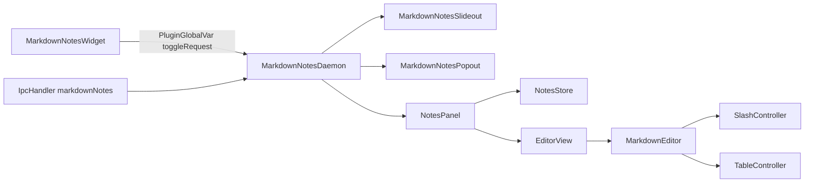

# AGENTS.md

Guía para agentes que modifiquen este repo. Léela entera antes de tocar el editor.

## Qué es

Plugin compuesto (`type: composite`) de [DankMaterialShell](https://github.com/AvengeMedia/DankMaterialShell) (Quickshell + Qt 6 QML). Añade un panel lateral y una ventana flotante de notas Markdown estilo Notion. Cada nota es un `.md` normal en `notesDir` (por defecto `~/Notes`).

- Instalación local: `install.sh` enlaza el repo en `~/.config/DankMaterialShell/plugins/markdownNotes`.
- IPC: `dms ipc call markdownNotes toggle|open|close|popout|dock|newNote`.

## Estructura

```
plugin.json                     manifiesto DMS (rutas ./src/...)
src/
  MarkdownNotesDaemon.qml       punto de entrada: ventanas, NotesPanel único, IPC
  MarkdownNotesWidget.qml       botón de la barra; pide toggle vía PluginGlobalVar
  MarkdownNotesSettings.qml     ajustes: notesDir, panelWidth, side
  store/NotesStore.qml          pestañas, archivos, sesión, recarga externa, renombrado
  editor/                       SIN imports qs.* (testeable con qmltestrunner)
    MarkdownEditor.qml          TextEdit MarkdownText + teclas + reescrituras
    SlashController.qml         estado y teclas del menú "/"
    TableController.qml         localizar celdas, operaciones, layout, medida y redimensionado
    TaskDecoration.qml          casilla dibujada sobre la de Qt
    RuleDecoration.qml          separador dibujado sobre el de Qt
    logic/markdown.js           funciones puras: bloques, parseLine, escape, decoraciones
    logic/tables.js             funciones puras: parse/serialize/prepare/repair/ops/layout/HTML
    logic/slash.js              comandos del menú "/" y filtro sin tildes
  panel/                        UI con componentes DMS (qs.Common, qs.Widgets)
    NotesPanel.qml              compone todo; guardado, atajos, acciones
    NoteTabs.qml  EditorView.qml  NoteFooter.qml  NoteMenu.qml
    PathInfoPopup.qml  SlashMenu.qml  TableToolbar.qml  TableResizeHandles.qml
    NoteFileDialogs.qml
  components/                   piezas reutilizables (IconButton, PopupSurface, MenuRow,
                                IconLabelButton, TitleBar)
  windows/                      MarkdownNotesSlideout.qml (PanelWindow), MarkdownNotesPopout.qml
tests/
  EditorTestCase.qml            base común: type(), md(), tables(), cellAt()...
  tst_*.qml                     logic, markdown_editor, slash, tables, tables_break, table_layout
```

Reglas:
- La lógica pura va en `editor/logic/*.js` (`.pragma library`, constantes exportadas con `var`).
- Todo lo visual y repetido va en `components/`. No dupliques popups, filas de menú ni botones: reutiliza `PopupSurface`, `MenuRow`, `IconButton`.
- `editor/` no puede importar `qs.*`, porque los tests corren fuera de DMS. Los colores llegan como propiedades desde `EditorView`.

## Flujo



- Hay un único `NotesPanel`. Su `parent` cambia entre el contenedor del panel lateral y el de la ventana flotante.
- Al editar: `edited` inicia el temporizador de guardado (700 ms) y luego se llama a `store.save(editor.markdown())`.
- `NotesStore` ignora el `fileChanged` que provocan sus propias escrituras durante 2 s.

## Qt MarkdownText: reglas que no se pueden romper

- **`text` en modo MarkdownText devuelve Markdown serializado por Qt.**
  - Usa `editor.markdownText`, que es una caché ya reparada. No leas `text` directamente.
  - Asigna el texto solo con `_assign(md)`. Esa función aplica `Tables.prepare` y resuelve el caso del texto vacío.
- **Técnica del marcador:** `rewriteLineAt(pos, fn)` inserta `\uE000`, busca la línea serializada, la reescribe, reasigna el texto y quita el marcador.
  - Si `pos` está al inicio de un bloque no vacío, el marcador se inserta desplazado un carácter, porque `insert()` resetea el formato del bloque.
- **Líneas en blanco:** se guardan como un párrafo con NBSP (`\u00A0`), porque Qt descarta los párrafos vacíos.
- **Separadores en el texto plano** (`getText`):
  - U+2029 separa bloques.
  - U+FDD0 va antes de cada celda de tabla.
  - U+FDD1 cierra la tabla.
  - `Md.blockRange` corta en los tres.
- **Tablas: entran como HTML y salen como Markdown.**
  - `Tables.prepare(md, style)` devuelve `{text, layouts}`. Convierte cada tabla `|` en una `<table>` HTML de una sola línea con borde fino del tema, `cellpadding` según la densidad y anchos en `%`. Con HTML, Qt no fusiona celdas vacías y las tablas pegadas a código o citas funcionan.
  - Las celdas de encabezado vacías llevan `&nbsp;`: si una columna entera está vacía, Qt escribe el separador como `|||` y la tabla deja de reconocerse.
  - Sigue haciendo falta un párrafo NBSP antes de una tabla al inicio del documento o justo después de otra tabla.
  - `Tables.inlineHtml` pasa el formato en línea (negrita, cursiva, tachado, código, enlaces, escapes) a HTML. Qt lo devuelve como Markdown.
  - Qt escribe `|` sin escapar dentro de las celdas y descarta el formato del encabezado. `Tables.repair(md, plain, layouts)` reconstruye las celdas comparándolas con el texto plano y vuelve a poner el comentario de layout encima de cada tabla.
- **Sin saltos de línea en celdas:** un U+2028 o U+2029 dentro de una celda hace que Qt parta la fila del Markdown y la tabla se rompe al recargar. Enter y Shift+Enter nunca insertan saltos dentro de una tabla. `_flattenCells` convierte en espacio cualquier salto que llegue pegado. Un `insert(p, " ")` no inserta nada en modo Markdown, así que el espacio va entre dos marcadores que luego se borran.
- **Texto duplicado en tablas:** el repintado parcial de `TextEdit` deja nodos de texto viejos dentro de las tablas tras reescribirlas o seleccionar celdas, y el texto se ve doble y grueso. `repaintTables()` alterna `_repaintFlip`, que cambia el azul de `selectedTextColor` en 1/255. Eso obliga a Qt a repintar todo el documento. Se llama 60 ms después de cada cambio de texto o de selección, solo si hay tablas. Por eso el color de selección llega como `selectionTextColor`.
- **Layout de tabla:** va en un comentario justo encima de la tabla, por ejemplo `<!-- tabla: ancho=100 columnas=40,30,30 alto=compacto -->`.
  - Las claves con valor por defecto se omiten (`ancho` automático, `columnas` automáticas, `alto=normal`). `columnas` son porcentajes enteros que suman 100.
  - Qt borra los comentarios HTML, así que `editor.tableLayouts` guarda los layouts leídos en `prepare`. Si cambia el número de tablas, `repair` los empareja por número de columnas.
  - `TableController` lee el layout de la línea encima de la tabla en `markdownText` y lo reescribe junto con la tabla (`_splice`).
  - Qt ignora `height` en celdas y filas. Por eso el alto es una densidad de toda la tabla (`cellpadding`), no un alto por fila.
- **Medida y arrastre:** `TableController.measure()` calcula los bordes de columna con `positionToRectangle` de las celdas de la primera fila menos el padding. El borde derecho se deduce del layout o del contenido. `TableResizeHandles` dibuja un `MouseArea` por borde y llama a `resize(tabla, borde, x)` al soltar. Las columnas tienen un mínimo del 5 % y el ancho de la tabla va del 15 % al 100 %.
- **Fuente monoespaciada:** el texto con esa fuente se guarda como `code`, así que la vista formateada usa una fuente proporcional.
- **Separador al inicio:** un `---` al principio del documento añade un bloque vacío antes (`Md.decorations` lo contempla).
- **Asignar `""`** conserva el formato del cursor anterior (por ejemplo, la negrita de un título). `_assign` pone el marcador y lo borra.
- **Orden de señales:** `cursorPositionChanged` puede llegar antes que `textChanged`. `TableController.model()` invalida su caché comparando también el texto plano.
- **Teclas simuladas:** los atajos que se prueban tecla a tecla deben ser síncronos. `Qt.callLater` no llega a ejecutarse entre las teclas simuladas.

## Convenciones

- Sin comentarios en el código. Los nombres van en inglés y los textos visibles en español.
- Usa los colores de `Theme` y los widgets de DMS (`StyledText`, `StyledRect`, `DankIcon`, `DankActionButton`, `DankTextField`).
- Los iconos son Material Symbols. Comprueba que el nombre existe antes de usarlo.
- Optimiza: `markdownText` se serializa una sola vez por cambio y los helpers puros evitan reparsear.

## Tests

```bash
pnpm test
```

- Usan `qmltestrunner -platform offscreen`. Los nuevos tests extienden `EditorTestCase`.
- `type()` hace `wait(0)` después de cada tecla.
- Para ver `console.log`, ejecuta con `QT_FORCE_STDERR_LOGGING=1`.
- Todo bug nuevo necesita su test de regresión. `tst_tables_break.qml` reúne los casos que intentan romper las tablas.

## Verificar en vivo

```bash
systemctl --user restart dms.service
journalctl --user -u dms.service --since -1min | rg -i "markdown|error"
dms ipc call markdownNotes open
dms screenshot full --no-clipboard -d /tmp --filename notas.png
```

## Commits

- Conventional Commits validados por commitlint (husky `commit-msg`). Cada línea del cuerpo tiene como máximo 100 caracteres.
- Rama `main`; remoto `haui-ju/dms-markdown-notes`.
