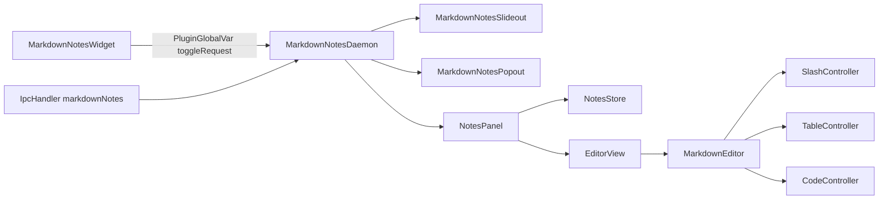

# AGENTS.md

Guía para agentes que modifiquen este repo. Léela entera antes de tocar el editor.

## Qué es

Plugin compuesto (`type: composite`) de [DankMaterialShell](https://github.com/AvengeMedia/DankMaterialShell) (Quickshell + Qt 6 QML). Añade un panel lateral y una ventana flotante de notas Markdown estilo Notion. Cada nota es un `.md` normal en `notesDir` (por defecto `~/Notes`).

- Instalación local: `install.sh` enlaza el repo en `~/.config/DankMaterialShell/plugins/markdownNotes`.
- IPC: `dms ipc call markdownNotes toggle|open|close|popout|dock|newNote`.

## Estructura

```
plugin.json                     manifiesto DMS (rutas ./src/...)
src/
  MarkdownNotesDaemon.qml       punto de entrada: ventanas, NotesPanel único, IPC
  MarkdownNotesWidget.qml       botón de la barra; pide toggle vía PluginGlobalVar
  MarkdownNotesSettings.qml     ajustes: notesDir, panelWidth, side
  store/NotesStore.qml          pestañas, archivos, sesión, recarga externa, renombrado
  store/NoteAssets.qml          guarda imágenes (portapapeles o archivos) en la carpeta de la nota
  editor/                       SIN imports qs.* (testeable con qmltestrunner)
    MarkdownEditor.qml          TextEdit MarkdownText + teclas + reescrituras
    SlashController.qml         estado y teclas del menú "/"
    TableController.qml         localizar celdas, operaciones, layout, medida y redimensionado
    CodeController.qml          localizar bloques de código, teclas, lenguaje, borrar, medida
    CodeDecoration.qml          fondo, selección y texto coloreado sobre el código de Qt
    TaskDecoration.qml          casilla dibujada sobre la de Qt
    RuleDecoration.qml          separador dibujado sobre el de Qt
    QuoteDecoration.qml         barra y fondo de las citas, detrás del texto
    ImageDecoration.qml         imagen real (o aviso) sobre el hueco que reserva Qt; clic = visor
    logic/markdown.js           funciones puras: bloques, parseLine, escape, decoraciones
    logic/tables.js             funciones puras: parse/serialize/prepare/repair/ops/layout/HTML
    logic/code.js               funciones puras: lenguajes, fences, prepare/repair, tokenizador
    logic/paste.js              funciones puras: normalizar y convertir lo pegado a Markdown
    logic/slash.js              comandos del menú "/" y filtro sin tildes
    logic/images.js             funciones puras: find/prepare/repair de imágenes, rutas, tamaños
  panel/                        UI con componentes DMS (qs.Common, qs.Widgets)
    NotesPanel.qml              compone todo; guardado, atajos, acciones
    NoteTabs.qml  EditorView.qml  NoteFooter.qml  NoteMenu.qml
    PathInfoPopup.qml  SlashMenu.qml  TableToolbar.qml  TableResizeHandles.qml
    CodeBlockBar.qml  CodeLanguageMenu.qml  NoteFileDialogs.qml  ImageViewerModal.qml
  components/                   piezas reutilizables (IconButton, PopupSurface, MenuRow,
                                IconLabelButton, TitleBar)
  windows/                      MarkdownNotesSlideout.qml (PanelWindow), MarkdownNotesPopout.qml
scripts/release.sh              sube la versión, commit chore(release) y tag vX.Y.Z
registry/                       ficha para AvengeMedia/dms-plugin-registry
CHANGELOG.md                    cambios por versión
tests/
  EditorTestCase.qml            base común: type(), md(), tables(), cellAt()...
  imports/qs/                   stubs mínimos de qs.Common y qs.Widgets para probar panel/
  tst_*.qml                     logic, markdown_editor, slash, tables, tables_break, table_layout, history,
                                code, paste, editor_view, images, frontmatter
```

Reglas:
- La lógica pura va en `editor/logic/*.js` (`.pragma library`, constantes exportadas con `var`).
- Todo lo visual y repetido va en `components/`. No dupliques popups, filas de menú ni botones: reutiliza `PopupSurface`, `MenuRow`, `IconButton`.
- `editor/` no puede importar `qs.*`, porque los tests corren fuera de DMS. Los colores llegan como propiedades desde `EditorView`.

## Flujo



- Hay un único `NotesPanel`. Su `parent` cambia entre el contenedor del panel lateral y el de la ventana flotante.
- Al editar: `edited` inicia el temporizador de guardado (700 ms) y luego se llama a `store.save(editor.markdown())`.
- `NotesStore` ignora el `fileChanged` que provocan sus propias escrituras durante 2 s.

## Qt MarkdownText: reglas que no se pueden romper

- **`text` en modo MarkdownText devuelve Markdown serializado por Qt.**
  - Usa `editor.markdownText`, que es una caché ya reparada. No leas `text` directamente.
  - Asigna el texto solo con `_assign(md)`. Esa función aplica `Code.prepare` y `Tables.prepare`, y resuelve el caso del texto vacío.
- **Técnica del marcador:** `rewriteLineAt(pos, fn)` inserta `\uE000`, busca la línea serializada, la reescribe, reasigna el texto y quita el marcador.
  - Si `pos` está al inicio de un bloque no vacío, el marcador se inserta desplazado un carácter, porque `insert()` resetea el formato del bloque.
- **Líneas en blanco:** se guardan como un párrafo con NBSP (`\u00A0`), porque Qt descarta los párrafos vacíos. En modo `PlainText` (vista Markdown), Qt devuelve ese NBSP como espacio normal. `Md.keepBlankLines` lo restaura al leer `text`, fuera de los bloques de código.
- **Separadores en el texto plano** (`getText`):
  - U+2029 separa bloques.
  - U+FDD0 va antes de cada celda de tabla.
  - U+FDD1 cierra la tabla.
  - `Md.blockRange` corta en los tres.
- **Tablas: entran como HTML y salen como Markdown.**
  - `Tables.prepare(md, style)` devuelve `{text, layouts}`. Convierte cada tabla `|` en una `<table>` HTML de una sola línea con borde fino del tema, `cellpadding` según la densidad y anchos en `%`. Con HTML, Qt no fusiona celdas vacías y las tablas pegadas a código o citas funcionan.
  - Las celdas de encabezado vacías llevan `&nbsp;`: si una columna entera está vacía, Qt escribe el separador como `|||` y la tabla deja de reconocerse.
  - Sigue haciendo falta un párrafo NBSP antes de una tabla al inicio del documento o justo después de otra tabla.
  - `Tables.inlineHtml` pasa el formato en línea (negrita, cursiva, tachado, código, enlaces, escapes) a HTML. Qt lo devuelve como Markdown.
  - Qt escribe `|` sin escapar dentro de las celdas y descarta el formato del encabezado. `Tables.repair(md, plain, layouts)` reconstruye las celdas comparándolas con el texto plano y vuelve a poner el comentario de layout encima de cada tabla.
- **Sin saltos de línea en celdas:** un U+2028 o U+2029 dentro de una celda hace que Qt parta la fila del Markdown y la tabla se rompe al recargar. Enter y Shift+Enter nunca insertan saltos dentro de una tabla. `_flattenCells` convierte en espacio cualquier salto que llegue pegado. Un `insert(p, " ")` no inserta nada en modo Markdown, así que el espacio va entre dos marcadores que luego se borran.
- **Texto duplicado en tablas:** el repintado parcial de `TextEdit` deja nodos de texto viejos dentro de las tablas tras reescribirlas o seleccionar celdas, y el texto se ve doble y grueso. `repaintTables()` alterna `_repaintFlip`, que cambia el azul de `selectedTextColor` en 1/255. Eso obliga a Qt a repintar todo el documento. Se llama 60 ms después de cada cambio de texto o de selección, solo si hay tablas. Por eso el color de selección llega como `selectionTextColor`.
- **Layout de tabla:** va en un comentario justo encima de la tabla, por ejemplo `<!-- tabla: ancho=100 columnas=40,30,30 alto=compacto -->`.
  - Las claves con valor por defecto se omiten (`ancho` automático, `columnas` automáticas, `alto=normal`). `columnas` son porcentajes enteros que suman 100.
  - Qt borra los comentarios HTML, así que `editor.tableLayouts` guarda los layouts leídos en `prepare`. Si cambia el número de tablas, `repair` los empareja por número de columnas.
  - `TableController` lee el layout de la línea encima de la tabla en `markdownText` y lo reescribe junto con la tabla (`_splice`).
  - Qt ignora `height` en celdas y filas. Por eso el alto es una densidad de toda la tabla (`cellpadding`), no un alto por fila.
- **Medida y arrastre:** `TableController.measure()` calcula los bordes de columna con `positionToRectangle` de las celdas de la primera fila menos el padding. El borde derecho se deduce del layout o del contenido. `TableResizeHandles` dibuja un `MouseArea` por borde y llama a `resize(tabla, borde, x)` al soltar. Las columnas tienen un mínimo del 5 % y el ancho de la tabla va del 15 % al 100 %.
- **Bloques de código: fences nativos de Qt + overlay.**
  - Qt conserva el lenguaje del fence, pero descarta un bloque vacío, la última línea en blanco de dentro, fusiona fences contiguos y convierte los tabuladores en 4 espacios. Un `<pre>` HTML se rompe; no lo uses.
  - `Code.prepare(md)` añade, solo del lado de Qt, una línea vacía de relleno tras el fence de apertura y otra antes del de cierre, y un párrafo NBSP al inicio del documento, entre fences contiguos y tras un bloque que cierra el documento. Sin ese NBSP final Qt no descarta la línea de relleno y un bloque vacío desaparece.
  - `Code.repair(md)` quita la primera línea vacía tras cada fence de apertura (la de cierre ya la descarta Qt). `Code.fences` solo cuenta fences cerrados: un ```` ``` ```` que se está escribiendo es texto hasta pulsar Enter.
  - `Md.decorations` devuelve `codes: [{fence, lang, lines: [{start, end, pad}]}]`; los rellenos llevan `pad: true`. `CodeController.at(pos)` da la línea y los límites del contenido (`contentStart`, `contentEnd`), sin contar los rellenos.
  - El cursor nunca se queda en un relleno: `clampCursor` lo mueve al contenido (con `Qt.callLater`, porque `cursorPositionChanged` llega antes que `textChanged`). Flechas, Retroceso y Supr en los bordes del contenido los maneja `CodeController.handleKey`. Enter nunca sale del bloque; Ctrl+Enter llama a `exit`. Shift+Enter inserta un U+2028 que Qt guarda como salto real y descuadra las decoraciones, así que se reemplaza por `insertInCode("\n")`.
  - `CodeDecoration` (z 1) tapa el código de Qt con un fondo opaco y dibuja la selección y el texto coloreado (`StyledText`, `&nbsp;` para no colapsar espacios) con `font.family: "monospace"` y el mismo tamaño, que coincide píxel a píxel con la fuente de código de Qt. El cursor es un `cursorDelegate` propio con z 10 para verse encima.
  - Los párrafos NBSP que añade `prepare` son necesarios: si se borran, el bloque se fusiona con el siguiente o se rompe. `CodeController.blankLine(pos)` indica si una línea NBSP pega con código (`before`, `after`) y si es imprescindible (`needed`). Retroceso sobre ella vuelve al final del bloque anterior (y la borra si sobra); Supr no borra una imprescindible; Enter crea la línea nueva con `BLANK + MARKER` para que el separador siga al final. Al salir con las flechas el cursor queda antes del NBSP, así que `tryEnterShortcut` trata una línea NBSP igual con el cursor a cualquier lado.
  - `CodeBlockBar` va en la línea de relleno superior: chip de lenguaje, copiar (`editor.code.copy`) y eliminar. `CodeLanguageMenu` vive en `EditorView` para no recortarse con el flickable.
  - Tras una lista, Qt duplica cada línea en blanco del código al serializar. `Code.repair` divide a la mitad las rachas de líneas en blanco de un bloque cuyo contenido anterior es un elemento de lista.
- **Pegar (`pasteClipboard`):** Ctrl+V y Shift+Insert no usan el pegado de Qt, que mete fuentes, colores y bloques HTML que rompen código y tablas.
  - El portapapeles se lee con dos `TextEdit` ocultos: uno `PlainText` y otro `MarkdownText`, que da la conversión de Qt del HTML a Markdown.
  - `Paste.fragment` decide: si el Markdown de Qt aporta algo frente al texto plano, se usa ese Markdown (con `mergeCodeRuns` para juntar los `<pre>`, que Qt convierte en código en línea por línea, y con las filas de tabla partidas por `<br>` unidas). Si no, una línea se escapa y varias se interpretan como Markdown solo si `looksLikeMarkdown`.
  - En código se inserta el texto plano en el fence (`Paste.forCode`, un fence dentro se neutraliza con U+200B). En celdas va en una línea con `|` escapado (`Paste.forCell`).
  - Se inserta con `rewriteAt(pos, fn, true)`. Si `pos` está al inicio del bloque, el marcador cae un carácter después: el punto real es tras el prefijo del bloque (`Paste.blockPrefix`), el primer carácter de la línea de código o el inicio de la celda (`Paste.cellStart`).
  - Si el fragmento acaba en un bloque (fence, tabla, separador), el cursor va a un párrafo NBSP debajo o al inicio del texto que seguía: un marcador en la línea de cierre del fence la rompe.
- **Imágenes: placeholder SVG + overlay.**
  - Qt descarta una imagen con alt vacío (``), ignora el HTML con `` y no carga un `<image href>` dentro de un SVG. Por eso `Images.prepare` sustituye cada imagen por ``: un hueco transparente del tamaño ya ajustado (`fit`, máximo `imageMaxWidth` × `imageMaxHeight`). `ImageDecoration` dibuja la imagen real encima.
  - `sources[url] = {alt, raw}` guarda el alt y la ruta originales. `Images.repair` los restaura y deshace los saltos que Qt mete alrededor de URLs largas: antes de la imagen, al inicio del párrafo y después, salvo si la línea siguiente empieza por lista, `>` o `#`.
  - El id `iN` viene de `_imageIds` (clave ruta + alt), para que dos imágenes iguales den URLs distintas y el placeholder sea estable entre reasignaciones.
  - El tamaño se mide una vez con un `Image` oculto síncrono (`imageProbe`) y se cachea en `_imageSizes`. Al cambiar el ancho, `imageLayoutTimer` rehace el placeholder con `replaceMarkdown`.
  - `_measureImages` empareja la k-ésima U+FFFC del texto plano con la k-ésima imagen de `Images.list`. La posición sale de `positionToRectangle`; si la línea tiene texto, la imagen se apoya en la línea base (`FontMetrics.descent`).
  - `Images.find` ignora las imágenes en código, código en línea, filas de tabla y `\![`. `insertImages` se niega dentro de código o tablas e inserta cada imagen como bloque.
  - Rutas: relativas a la carpeta de la nota (`imageBaseDir`), codificadas con `Images.encodePath` (`encodeURI` + paréntesis). Al renombrar o mover la nota, `NotesStore.moved` → `retargetImages(viejo/, nuevo/)`.
  - Portapapeles: un portapapeles solo con espacios o vacío en texto emite `imagePasteRequested`; `NoteAssets` lee `dms clipboard history --json`, y si la entrada más reciente es imagen la guarda con `dms clipboard get ID | base64 -d`. Rutas de imagen copiadas emiten `imageFilesPasted`. No hay `wl-paste`.
  - El visor (`ImageViewerModal`) usa `useOverlayLayer` para quedar sobre el panel lateral, y mide la imagen con el `Image` de su contenido: un `Image` fuera de una ventana no carga.
- **Deshacer propio:** el undo de Qt se vacía en cada asignación de `text` y guarda los marcadores, así que Ctrl+Z / Ctrl+Y / Ctrl+Shift+Z los maneja `MarkdownEditor` (también en `onShortcutOverride`).
  - Pila de estados `{md, start, end}` (`_undoStack`, `_redoStack`, `_committed`). `edited` → `_noteChange` abre un grupo; se cierra con 1 s sin cambios, al cambiar de tipo de tecla (escribir, espacio, Retroceso, Supr), si el cursor no está donde lo dejó la última tecla (`_groupCaret`), con Enter/Tab/Ctrl+V/Ctrl+X y antes y después de cada `rewriteAt`/`replaceMarkdown`. Así cada reescritura es un paso propio.
  - El grupo se corta antes del espacio, no después: Qt quita los espacios finales de un párrafo al reasignar el Markdown, y un estado que termina en espacio lo perdería.
  - `_markBefore()` guarda la selección previa al cambio; llámalo antes de cualquier modificación nueva que no pase por teclas, `rewriteAt` ni `replaceMarkdown`.
  - `load(md)` borra el historial; `load(md, true)` (recarga externa) lo conserva como un paso. `NotesPanel.histories` guarda `historyState()` por ruta al cambiar de pestaña y `restoreHistory` solo lo acepta si el contenido coincide. `retargetImages` corrige también las rutas de los estados guardados.
- **Títulos vacíos:** tras `# ` o Ctrl+1 el bloque queda vacío con formato de título, pero lo que se escribe toma el formato normal del bloque hasta la siguiente reasignación. `_armEmptyHeading` recuerda la posición y el nivel; la primera tecla imprimible hace `insert(pos, "# " + char)`, que aprovecha que `insert()` al inicio del bloque aplica el formato del fragmento. No uses el marcador ahí: insertarlo al inicio de un bloque vacío borra el título.
- **Título vacío al serializar:** Qt escribe un título vacío como `# ` sin salto de línea, pegado al bloque siguiente (`# fin`, `## - item`), y al recargar ese bloque se vuelve título. `Md.repairEmptyHeadings(md, plain)` alinea los bloques Markdown con el texto plano como `decorations`, y cuando un título está vacío en el texto plano y su contenido coincide con el bloque siguiente, lo separa y lo guarda como `# ` + NBSP. Al escribir en ese título (`_typeIntoBlankHeading`, se detecta por la altura de la línea) el NBSP se sustituye por la letra con una reescritura, para que tenga formato de título.
- **Alineación Markdown ↔ texto plano** (`Md.decorations`, `repairEmptyHeadings`): si falla, `decorations` devuelve `null` y no hay bloques de código, casillas ni separadores dibujados. En el texto plano una imagen es U+FFFC (`norm` lo quita) y el cierre de una tabla (U+FDD1) deja un bloque vacío que no corresponde a nada (se salta). Cualquier bloque nuevo de Qt que aparezca en el texto plano debe tener su equivalente aquí.
- **Separador + código:** Qt no escribe un separador seguido directamente de un fence. `Code.prepare` pone un párrafo NBSP entre ambos y `blankLine` lo marca como `needed` (`_afterRule`).
- **Front matter:** Qt 6.11 reconoce el YAML inicial (`---`…`---`), lo oculta y lo devuelve en `text`. No hay que hacer nada, pero no rompas esa primera línea `---` (no es un separador).
- **Interlineado:** `TextEdit` no tiene `lineHeight` ni margen de párrafo en QML, el importador Markdown no aplica márgenes a los párrafos y un `<p style="line-height">` crea o fusiona bloques. Probado también `<h1 style="margin-top">`, `<div>` alrededor y `&nbsp;` delante: el bloque HTML se funde con el párrafo anterior y el título se guarda como negrita. Solo los marcos (tablas) respetan márgenes. No hay forma fiable sin C++.
- **Separación de bloques (`blockGap`, media línea):** la `<table>` lleva `margin-top`/`margin-bottom` (Qt sí los respeta) y el placeholder de cada imagen es `2 × blockGap` más alto; `_measureImages` dibuja la imagen `blockGap` por debajo del inicio de la línea, que en Qt mide exactamente lo que el placeholder.
- **Citas:** Qt las sangra 40 px sin ninguna marca. `Md.blocks` marca los párrafos con `quote` y `group` (un `>` vacío no corta el grupo, una línea en blanco sí; una línea sin `>` tras una cita la continúa) y quita de su texto los prefijos de lista y título. `decorations().quotes` da `{start, end}` por grupo y `QuoteDecoration` (z −1, detrás del texto) dibuja fondo y barra.
- **Cita vacía:** Qt no escribe nada para un bloque de cita vacío, así que se perdería al guardar y no se podría dibujar. Una cita vacía siempre es `> ` + NBSP: `_quoteLine` al crearla (`> `, `/cita`, `setBlockType`), `_blankQuote` al borrar su último carácter (Retroceso, Supr o selección completa) y Enter al final de una cita escribe `>` + `> ` NBSP. Escribir en ella quita el NBSP (`clearBlankLine`) y el formato de cita sigue, porque vive en el bloque y no en los caracteres. Retroceso en una cita vacía la convierte en línea en blanco; Enter sale de ella.
- **Vista Markdown:** al pasar de `MarkdownText` a `PlainText`, Qt convierte el documento aplicando a todo el formato de carácter del cursor (título, código). `setSourceMode(true)` asigna antes un documento de un carácter y mueve el cursor para que el formato sea el normal.
- **Clipboard sin dependencias:** en `editor/`, `copyPlain(text)` copia con un `TextEdit` oculto; en `panel/`, `Quickshell.clipboardText = text`. No uses `wl-copy`: no siempre está instalado.
- **Botones que aparecen al pasar el ratón:** ocúltalos con `opacity`, no con `visible`. Al presionar, `HoverHandler` deja de reportar hover, el botón se oculta y el clic no llega.
- **Delegados con propiedades `required`:** `editor: editor` dentro del delegado se enlaza a la propia propiedad (queda `undefined`) y los clics fallan sin error visible en DMS. Usa `editor: root.editor`.
- **MouseArea de fondo:** decláralo antes que los botones hermanos. Si va después, queda encima y les roba el clic aunque el botón tenga `z` alto dentro de su padre.
- **Fuente monoespaciada:** el texto con esa fuente se guarda como `code`, así que la vista formateada usa una fuente proporcional.
- **Separador al inicio:** un `---` al principio del documento añade un bloque vacío antes (`Md.decorations` lo contempla).
- **Asignar `""`** conserva el formato del cursor anterior (por ejemplo, la negrita de un título). `_assign` pone el marcador y lo borra.
- **Orden de señales:** `cursorPositionChanged` puede llegar antes que `textChanged`. `TableController.model()` invalida su caché comparando también el texto plano.
- **Teclas simuladas:** los atajos que se prueban tecla a tecla deben ser síncronos. `Qt.callLater` no llega a ejecutarse entre las teclas simuladas.

## Convenciones

- Sin comentarios en el código. Los nombres van en inglés y los textos visibles en español.
- Usa los colores de `Theme` y los widgets de DMS (`StyledText`, `StyledRect`, `DankIcon`, `DankActionButton`, `DankTextField`).
- Los iconos son Material Symbols. Comprueba que el nombre existe antes de usarlo.
- Optimiza: `markdownText` se serializa una sola vez por cambio y los helpers puros evitan reparsear.

## Tests

```bash
pnpm test
```

- Usan `qmltestrunner -platform offscreen -import tests/imports`. Los nuevos tests extienden `EditorTestCase`.
- `tst_editor_view.qml` carga el `EditorView` real con los stubs de `tests/imports/qs` y hace clic en los botones del bloque de código. `failOnWarning` convierte cualquier `TypeError` en fallo. Si un componente de `panel/` usa algo nuevo de `Theme` o de los widgets, añádelo al stub.
- `type()` hace `wait(0)` después de cada tecla.
- Para ver `console.log`, ejecuta con `QT_FORCE_STDERR_LOGGING=1`.
- Todo bug nuevo necesita su test de regresión. `tst_tables_break.qml` reúne los casos que intentan romper las tablas.

## Verificar en vivo

```bash
systemctl --user restart dms.service
journalctl --user -u dms.service --since -1min | rg -i "markdown|error"
dms ipc call markdownNotes open
dms screenshot full --no-clipboard -d /tmp --filename notas.png
```

## Renombrado y archivos

- `NotesStore` identifica las pestañas por ruta, nunca por índice guardado: `renameAt(index, title)` resuelve la ruta al pedirlo y `renameProc` actualiza la pestaña buscando `source` al terminar. `NoteTabs` emite el índice de la pestaña que se estaba editando, porque al hacer clic en otra pestaña el cambio llega antes que `editingFinished`.
- Los movimientos se encolan en `_pendingMoves` (un `Process` ignora `running = true` si ya corre).
- Renombrar a mano falla con código 3 si el destino existe → `renameFailed` → aviso. El renombrado por título (`uniquify`) añade `-2`, `-3`...
- Si la nota movida no es la actual, `NotesPanel.retargetAssets` corrige los enlaces de imágenes en el archivo (`store.retargetFile`), no en el editor.

## Versiones

- Semver en `plugin.json` y `package.json` (iguales), tag `vX.Y.Z` y entrada en `CHANGELOG.md` por versión. `pnpm release X.Y.Z` hace todo menos el push.
- `registry/haui-ju-markdown-notes.json` es la ficha para `AvengeMedia/dms-plugin-registry`; `id` y `name` deben coincidir con `plugin.json`.

## Commits

- Conventional Commits validados por commitlint (husky `commit-msg`). Cada línea del cuerpo tiene como máximo 100 caracteres.
- Rama `main`; remoto `haui-ju/dms-markdown-notes`.
