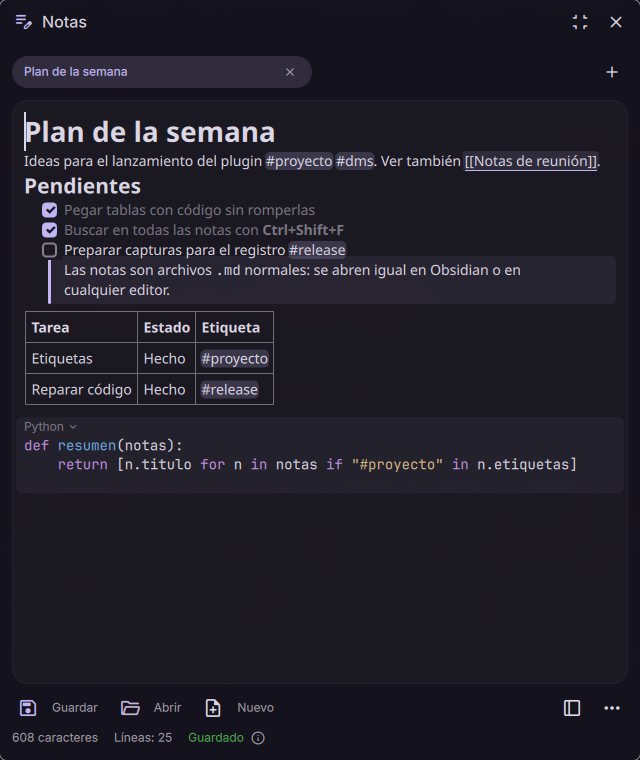

# dms-markdown-notes

Plugin para [DankMaterialShell](https://github.com/AvengeMedia/DankMaterialShell) que añade un panel lateral de notas Markdown estilo Notion: el formato se ve mientras escribes y cada nota es un archivo `.md` normal en `~/Notes`.



## Instalación

```bash
git clone https://github.com/haui-ju/dms-markdown-notes.git
cd dms-markdown-notes
./install.sh
```

`install.sh` enlaza el repo en `~/.config/DankMaterialShell/plugins/markdownNotes`, crea `~/Notes`, activa el plugin y añade el botón a la barra (reinicia `dms.service` si está corriendo).

Atajo global opcional en Hyprland:

```ini
bind = SUPER, N, exec, dms ipc call markdownNotes toggle
```

Comandos IPC: `toggle`, `open`, `close`, `newNote`, `popout` (ventana flotante), `dock` (volver al panel lateral), `openNote <nota>` y `search <texto>`:

```bash
dms ipc call markdownNotes openNote "diario/$(date +%F)"   # relativa a la carpeta de notas; se crea al escribir
dms ipc call markdownNotes openNote ~/proyecto/README.md    # o una ruta absoluta
dms ipc call markdownNotes search "#pendiente"              # abre el buscador con ese texto o etiqueta
```

Para ver todo lo que hace, abre la nota de ejemplo, que enseña cada función en uso:

```bash
dms ipc call markdownNotes openNote ~/.config/DankMaterialShell/plugins/markdownNotes/examples/"Ejemplo completo.md"
```

## Interfaz

Igual que el Notepad de DMS: pestañas de notas abiertas (× cierra la pestaña sin borrar el archivo, doble clic renombra, + crea), botón para ampliar/contraer el panel, **Guardar** (en notas sin nombre abre "Guardar como"), **Abrir** (cualquier `.md`), **Nuevo**, ventana flotante, menú `…` (buscar en las notas, ver Markdown, reparar barras en código si hace falta, renombrar, abrir carpeta, mover a la papelera) y barra de estado con caracteres, líneas, estado de guardado y ruta del archivo (ⓘ). Las pestañas abiertas se recuerdan entre sesiones.

## Escritura

| Escribes | Resultado |
| --- | --- |
| `# `, `## `, `### ` | Título H1, H2, H3 (con su tamaño desde la primera letra) |
| `- ` o `* ` | Lista con viñetas |
| `1. ` | Lista numerada |
| `[] ` o `- [] ` | Checkbox (clic en la casilla para marcarla) |
| `> ` | Cita (con barra y fondo, también vacía) |
| `---` + Enter | Separador |
| ```` ``` ```` + Enter | Bloque de código |
| `**texto**`, `*texto*`, `` `texto` ``, `~~texto~~` | Negrita, cursiva, código, tachado |
| `[[Nota]]` | Enlace a otra nota (ver [Enlaces entre notas](#enlaces-entre-notas)) |
| Enter en un elemento vacío | Termina la lista |
| Enter al final de un título | La línea siguiente es texto normal |
| Enter al final de una cita | Otro párrafo de la cita; Enter en uno vacío sale de ella |
| Retroceso al inicio de un título, cita o lista | Vuelve a texto normal |

## Menú `/`

Escribe `/` al inicio de una línea (o después de un espacio) para abrir el menú de bloques, como en Notion. Lo que escribas después filtra la lista sin importar tildes (`/tab`, `/titulo`, `/tareas`). Flechas para moverte, Enter o Tab para aplicar, Esc para cerrar.

Bloques: Texto, Título 1-3, Lista, Lista numerada, Lista de tareas, Cita, Separador, Bloque de código, **Tabla** e **Imagen**.

## Tablas

- `/tabla` crea una tabla de 3×3 (encabezado + 2 filas) con alto de fila amplio y "Columna 1" seleccionado para que empieces a escribir.
- **Tab** / **Shift+Tab**: celda siguiente / anterior. Tab en la última celda crea una fila.
- **Enter**: celda de abajo; en la última fila sale de la tabla.
- Con el cursor dentro aparece una barrita para añadir o eliminar filas y columnas, poner la tabla a ancho completo, igualar columnas, cambiar el alto de filas (compacto, normal o amplio) o eliminar la tabla. Las mismas opciones salen al escribir `/` dentro de una celda.
- **Arrastrar**: pasa el ratón por el borde entre dos columnas (o por el borde derecho de la tabla) y arrastra para cambiar el ancho.
- **Igualar columnas** reparte el ancho de la tabla a partes iguales; si la tabla era automática, pasa a ocupar el 100 %.
- Se guardan como tablas Markdown normales (`| a | b |`). Si cambias anchos o alto, se añade un comentario invisible justo encima, que otros editores ignoran:

  ```markdown
  <!-- tabla: ancho=100 columnas=40,30,30 alto=compacto -->
  | ID | Descripción | Total |
  ```

## Bloques de código

- `/codigo` o ```` ``` ```` + Enter crean un bloque. Para indicar el lenguaje, escríbelo tras las comillas (```` ```python ````) o elígelo después en el bloque.
- Se colorea la sintaxis de Bash, C, C++, CSS, Go, HTML, Java, JavaScript, JSON, Markdown, Python, QML, Rust, SQL, TypeScript y YAML, con colores armonizados con el tema.
- Al pasar el ratón o poner el cursor dentro aparecen los botones: el lenguaje (arriba a la izquierda) abre la lista para cambiarlo; a la derecha están **copiar** y **eliminar bloque**.
- Enter y Shift+Enter crean líneas dentro del bloque; nunca sacan de él. Para salir: **Ctrl+Enter** (crea una línea debajo del bloque) o **flecha abajo** en la última línea. Las flechas también entran y salen.
- Retroceso en un bloque vacío lo convierte en texto normal. Retroceso en la línea justo debajo de un bloque vuelve al final del bloque sin romperlo.
- Dentro del bloque no se aplican atajos Markdown, formato ni el menú `/`: el texto se guarda tal cual.

## Imágenes

- Pega una imagen con **Ctrl+V** (una captura, una imagen copiada de la web o del gestor de archivos) o escribe `/imagen` para elegir un archivo.
- La imagen se guarda en una carpeta junto a la nota con el mismo nombre: `~/Notes/mi-nota.md` guarda sus imágenes en `~/Notes/mi-nota/`. En el Markdown queda un enlace relativo: ``.
- Se ven dentro de la nota, ajustadas al ancho del panel (máximo 480 px de alto). Si el archivo no existe se muestra un aviso con la ruta.
- **Clic en una imagen**: abre un visor flotante con botones para abrirla con otra aplicación, abrir su carpeta, eliminarla (dos clics: la quita de la nota y manda el archivo a la papelera) o cerrar.
- Al renombrar la nota, guardarla con otro nombre o borrarla, la carpeta de imágenes la acompaña y los enlaces se actualizan.
- También se muestran imágenes con ruta absoluta o URL (`https://...`), pero no se copian a la carpeta.

## Enlaces entre notas

- Escribe `[[Nombre de la nota]]` (sin `.md`). También vale `[[Nota|texto]]`, `[[Nota#sección]]` (abre la nota) y `[[carpeta/Nota]]`, como en Obsidian.
- El enlace se resalta y el cursor cambia a una mano al pasar por encima. **Clic** abre la nota en una pestaña; para editar el enlace, pon el cursor con el teclado o haz clic justo después de `]]`.
- Se busca por nombre en toda la carpeta de notas, sin distinguir mayúsculas; si hay varias con ese nombre gana la de la misma carpeta que la nota actual y luego la menos profunda.
- Si no existe, se crea en la carpeta de notas con `# Nombre` como título.
- En el archivo queda tal cual (`[[Nota]]`), así que otros editores como Obsidian lo entienden.

## Buscar

- **Ctrl+F** (o menú `…` → Buscar en las notas) abre un buscador de texto en todos los `.md` de la carpeta de notas, subcarpetas incluidas.
- Busca el texto literal sin distinguir mayúsculas, a partir de 2 letras. Muestra la nota, su carpeta y la línea con la coincidencia resaltada (hasta 100 resultados, 20 por nota).
- Flechas para moverte, Enter o clic para abrir: la nota se abre con la coincidencia seleccionada. Esc o Ctrl+F otra vez lo cierran.
- Se ignoran carpetas ocultas (`.git`, `.trash`...). La nota actual se guarda antes de buscar.

## Etiquetas

- Escribe `#etiqueta` en cualquier parte del texto, como en Obsidian: letras (con tildes), números, `-`, `_` y `/` para anidar (`#proyecto/web`). Tiene que llevar al menos una letra (`#123` no es etiqueta) y un título `# ` no cuenta.
- También valen las del front matter: `tags: [idea, web]` o una lista `tags:` con `- idea`.
- Se ven resaltadas; **clic** en una abre el buscador con esa etiqueta.
- En el buscador, `#` solo lista todas las etiquetas con cuántas notas las usan; elige una para ver sus notas. `#proyecto` encuentra también `#proyecto/web`.
- No cuentan las que están en código, en URLs (`https://x.com/#id`) ni en enlaces a secciones (`[texto](#id)`).

## Pegar

- Desde una web o un documento se conservan los títulos, listas, negritas, enlaces, tablas y código, pero no las fuentes, colores ni tamaños.
- Un texto plano de varias líneas con sintaxis Markdown (`# `, `- `, ```` ``` ````, tablas) se convierte en bloques. Si no la tiene, cada línea pasa a ser un párrafo.
- Una sola línea se pega tal cual, sin interpretar `*` ni `#`.
- Código copiado de un editor o terminal (texto monoespaciado) se pega como bloque de código.
- Dentro de un bloque de código se pega siempre texto plano y queda dentro del bloque.
- Dentro de una celda el texto se pega en una sola línea, para no romper la tabla.
- Una imagen, o rutas de archivos de imagen copiadas del gestor de archivos, se guardan en la carpeta de la nota (ver [Imágenes](#imágenes)).
- **Ctrl+Shift+V** pega como texto plano, sin formato.

## Atajos

| Atajo | Acción |
| --- | --- |
| Ctrl+B / Ctrl+I / Ctrl+E | Negrita / cursiva / código sobre la selección |
| Ctrl+1 / Ctrl+2 / Ctrl+3 / Ctrl+0 | H1 / H2 / H3 / párrafo |
| Ctrl+L | Convertir en checkbox (o quitarlo) |
| Ctrl+Shift+L / Ctrl+Shift+O | Lista con viñetas / numerada |
| Ctrl+Shift+M | Alternar vista formateada / Markdown crudo |
| Ctrl+F | Abrir o cerrar el buscador de notas (Esc también cierra) |
| Ctrl+Z / Ctrl+Y (o Ctrl+Shift+Z) | Deshacer / rehacer |
| Ctrl+N / Ctrl+O / Ctrl+S / Ctrl+W / Esc | Nueva / abrir / guardar / cerrar pestaña / cerrar panel |

## Deshacer

- **Ctrl+Z** deshace palabra por palabra (o lo escrito antes de una pausa de 1 s). **Ctrl+Y** o **Ctrl+Shift+Z** rehace.
- Cada autoformato, tabla, bloque de código, pegado, imagen o cambio de tipo de bloque es un paso propio: deshacer un `# ` vuelve al `#` escrito.
- Cada pestaña guarda su historial mientras está abierta. Una recarga porque el archivo cambió fuera también se puede deshacer.

## Notas

- Las notas nuevas se llaman `nota-<fecha>.md` y se renombran solas con su primer `# título`. Si ya existe una nota con ese nombre, se añade `-2`, `-3`...
- Renombrar (doble clic en la pestaña o menú `…`) solo afecta a esa pestaña, aunque cambies a otra antes de confirmar. Si el nombre ya existe no se sobrescribe nada: aparece un aviso.
- Si hay dos pestañas con el mismo nombre en carpetas distintas, la pestaña muestra también la carpeta (`ideas · trabajo`).
- **Propiedades (front matter):** un bloque YAML al inicio (`---` / `title: ...` / `---`), como los de Obsidian o Hugo, se conserva intacto y no se muestra en la vista formateada. Se ve y se edita en la vista Markdown (Ctrl+Shift+M).
- Se guardan automáticamente; borrar mueve el archivo a la papelera (`gio trash`).
- Si el archivo cambia fuera del panel (otro editor, `git pull`), se recarga.
- Ajustes del plugin: carpeta de notas, fuente de las notas (Noto Sans por defecto, que separa más las líneas; vacío = fuente del sistema), ancho del panel y lado (izquierda/derecha).

## Limitaciones

- La vista formateada usa la fuente normal del sistema, no la monoespaciada: Qt guarda el texto en fuente monoespaciada como `código`.
- Qt normaliza el Markdown al guardar (por ejemplo `*` puede quedar como `-` y los párrafos largos se envuelven a ~80 columnas). El contenido no cambia.
- El formato dentro del encabezado de una tabla (negrita, código...) no se guarda: Qt lo descarta al escribir el Markdown.
- Las tablas no admiten celdas combinadas ni varias líneas por celda, y la alineación de columnas (`:---:`) se pierde.
- El alto se ajusta para toda la tabla, no fila a fila: Qt ignora la altura de las filas.
- Las imágenes no se pueden redimensionar ni poner dentro de tablas o bloques de código. El texto alternativo (``) se conserva pero no se muestra.
- Pegar una imagen requiere el historial del portapapeles de DMS (`dms clipboard`).
- No hay bloques arrastrables.
- El interlineado y la separación entre párrafos no se pueden ajustar: el `TextEdit` de Qt no expone esas propiedades a QML y el importador Markdown no las aplica. Las tablas y las imágenes sí llevan un margen propio. El alto de línea depende de la fuente: Noto Sans da unos 20 px a 14 px frente a los 17 de Inter.
- Un título dentro de una cita (`> # título`) sale de la cita al guardar: Qt no lo escribe.
- Un `|` dentro de un enlace `[[Nota|texto]]` en una celda de tabla corta la celda. En tablas usa `[[Nota]]`.
- La búsqueda usa `grep` (y `find` + `awk` para las etiquetas) y lee los archivos del disco: no encuentra notas con otra extensión que `.md`.
- Si una etiqueta aparece a la vez en código en línea y fuera, el editor puede resaltar la del código en lugar de la otra: el texto que ve Qt no distingue el código en línea.
- Las notas guardadas con versiones anteriores a la 0.7.0 pueden tener barras invertidas de más en el código en línea (`\\\#`). Menú `…` → **Reparar barras en código** las quita (se puede deshacer). La opción solo aparece si la nota las tiene.
- Qt lee `__texto__` igual que `_texto_` y lo guarda así; en el editor se ve igual, pero otros visores lo mostrarán en cursiva en vez de negrita. Usa `**texto**` para negrita.
- Los bloques de código no ajustan las líneas largas y los tabuladores se guardan como 4 espacios.
- Un bloque de código al inicio o al final de la nota lleva una línea en blanco (NBSP) al lado para poder escribir antes o después.

## Desarrollo

Guía de arquitectura para agentes y colaboradores: [AGENTS.md](AGENTS.md).

Requiere Qt 6 (`qmltestrunner`) para los tests del editor:

```bash
pnpm install   # instala husky + commitlint
pnpm test
```

Los commits siguen [Conventional Commits](https://www.conventionalcommits.org/) y se validan con commitlint.

## Versiones

El proyecto usa [versionado semántico](https://semver.org/lang/es/). La versión vive en `plugin.json` y `package.json`, cada versión publicada lleva un tag `vX.Y.Z` y los cambios se anotan en [CHANGELOG.md](CHANGELOG.md). Para publicar una versión:

```bash
pnpm release 0.7.0   # sube la versión, crea el commit y el tag
git push --follow-tags
```

El archivo para el [registro de plugins de DMS](https://github.com/AvengeMedia/dms-plugin-registry) está en `registry/haui-ju-markdown-notes.json`.
